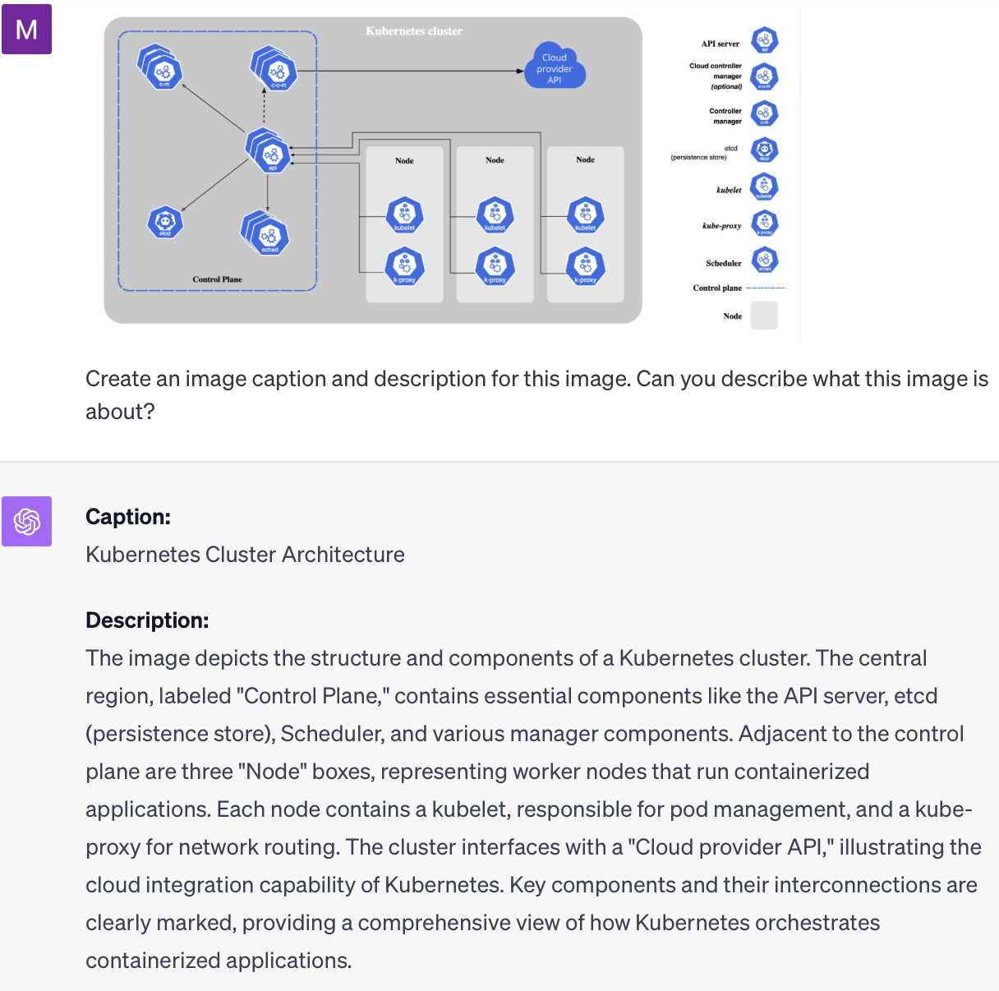
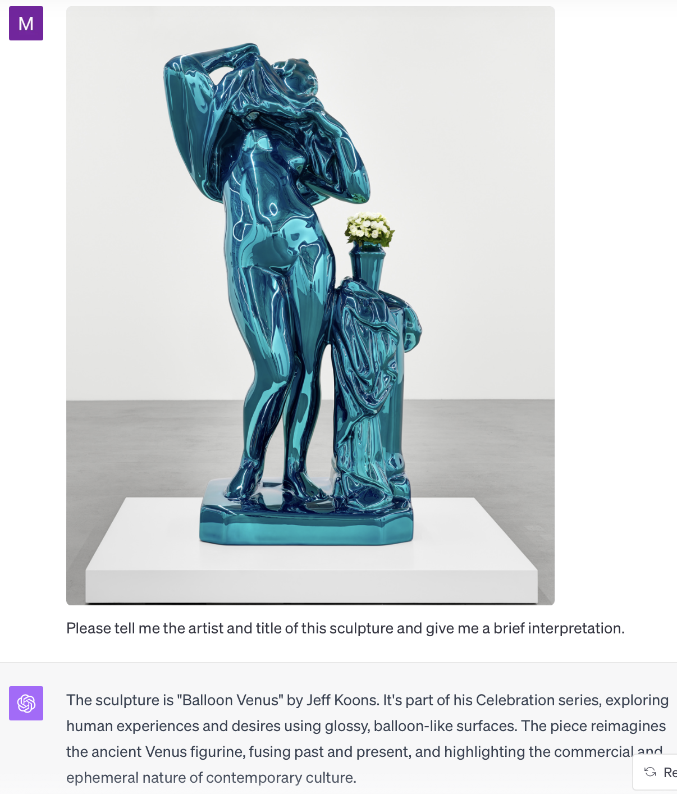
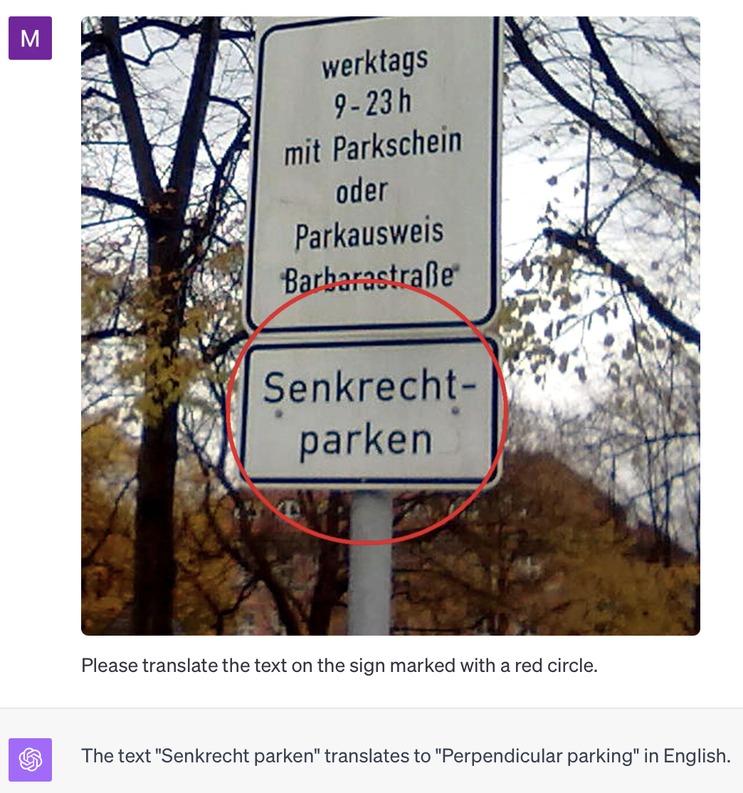
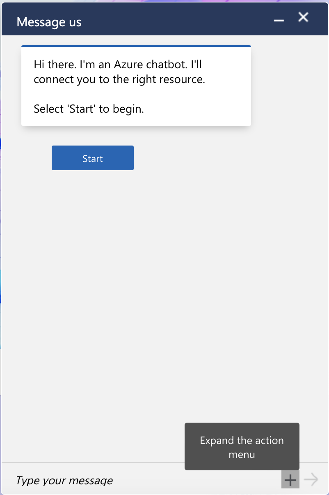
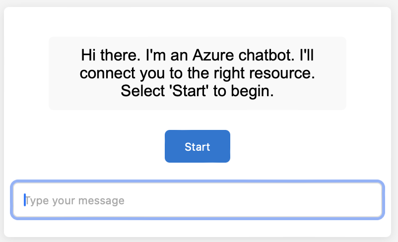
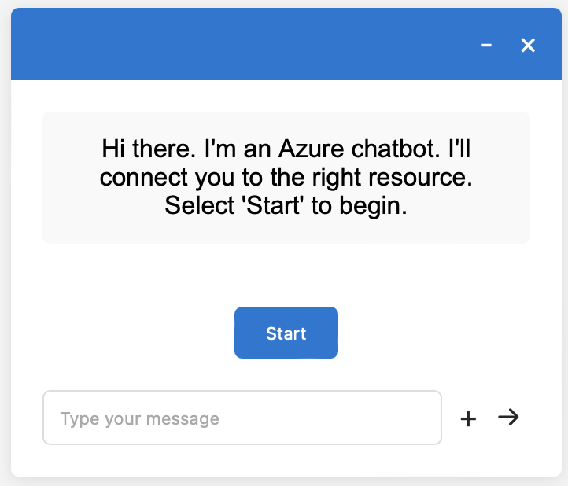
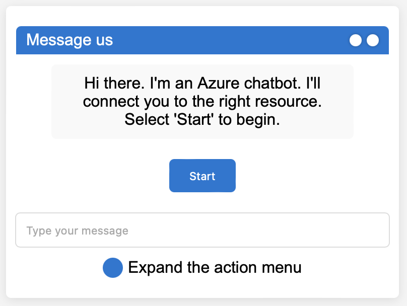

---
aliases:
- /blog/2023/10/25/chatgpt-image-inputs-use-cases/
author: null
categories:
- Playground
- Blog
date: 2023-10-25
draft: false
slug: use-cases-fuer-bild-eingaben-in-chatgpt
tags:
- ChatGPT
- OpenAI
title: Use Cases für Image Inputs in ChatGPT
---

Mit GPT-4 in ChatGPT Plus kannst du jetzt Bilder an eine Unterhaltung anhängen. Hier sind einige Beispiele dafür, was mit Bildern in ChatGPT möglich ist.

<!-- more -->

Ich nehme an, dass OpenAI unter der Haube das Modell `gpt-4-vision-preview` verwendet. Wenn ich hier `GPT-4` schreibe, meine ich die Vision Variante.

Du kannst PNG- oder JPEG-Bilder mit bis zu 20 MB hochladen und in einer Session auch mehr als ein Bild hochladen. Derzeit können Chats mit Bildern nicht geteilt werden. Deshalb habe ich die Chats hier teilweise mit aufgenommen.

## Komplexe Diagramme verstehen

GPT-4 kann komplexe Diagramme verstehen und sie in einfachen Worten erklären. Das ist zum Beispiel nützlich zum Lernen, für Bildunterschriften und zum Beschreiben von Bildern.

Hier ist ein Beispiel dafür, wie ChatGPT mit GPT-4 ein Kubernetes-Architekturdiagramm interpretiert und wie GPT es beschreibt. Das wurde mit einem einfachen Prompt erzeugt, und bereits der erste Versuch war erfolgreich:



## Quellen identifizieren und Kunst interpretieren

GPT-4 kann Objekte erkennen und ihre Quelle identifizieren. Es kann die Objekte auch interpretieren und sie künstlerischen Stilen oder ähnlichen Kategorien zuordnen. Das lässt sich zum Beispiel anwenden auf Kunst, Memes, Konzept-Diagramme, Architektur, Möbel und Mode.

Hier ist ein Beispiel dafür, dass GPT-4 eine Skulptur von Jeff Koons identifizieren und recht ansprechend interpretieren kann. Diese Skulptur war in der [Galerie Max Hetzler](https://www.maxhetzler.com) in Berlin ausgestellt.



Das Ergebnis wurde mit einer Custom Instruction erstellt und funktionierte wieder im ersten Versuch. Die Custom Instruction lautete:

```markdown
I am a student of modern art and want to understand 
who created an artwork and how it can be interpreted.

Please create brief answers.
```

## Text in Bildern übersetzen

GPT-4 kann auch Text in Bildern erkennen und übersetzen. Das ist zum Beispiel nützlich zum Lernen, verstehen und kommunizieren.



GPT-4 in Kombination mit spezialisierten OCR-Modellen führt eventuell zu besseren Ergebnissen, aber GPT-4 ist auch ohne weitere Hilfe schon sehr gut. Die Custom Instruction war:

```markdown
I am a visitor to Germany from Australia 
and cannot understand German.

Please create brief answers.
```

## Code auf Basis von Bildern schreiben

Da GPT-4 sowohl Bilder interpretieren als auch Code schreiben kann, kannst du es verwenden, um Code auf Basis eines Bildes zu erzeugen. Hier ist ein Beispiel für html- und css-code, aber das funktioniert auch für Datenbankcode (SQL), Python-Code oder anderen Code wie Mermaid-Diagrammcode:

Dies ist die Chatbot-Box von Azure. Kann ChatGPT HTML- und CSS-Code erzeugen, um sie nachzubilden?



Ich habe ChatGPT einige Custom Instructions gegeben:

```markdown
I am a web developer and need to 
convert designs into HTML and CSS.

Please create working html with 
embedded css code without explanations.
```

Dann antwortete ChatGPT mit [generiertem Code](chat.html) die in einem Browser so dargestellt wird:



Nicht schlecht für den Anfang, aber es geht noch besser.

## Mit generierten Bildern iterieren

Da CPT-4 Dall-E verwenden kann, um Bilder zu generieren, kann man über Bild-Inputs iterieren, indem man neue Bilder erzeugt, die auf vorherigen Bildern in Kombination mit weiteren Anweisungen basieren. Das verbessert die Kontrolle beim Erstellen von Bildern.

Da sich das Ergebnis des obigen Codes auch als Bild erfassen lässt, habe ich mich gefragt, ob ich Iteration nutzen kann, um das Ergebnis zu verbessern.

Ich habe ein Bild des Browser-Renderings genommen, die Unterschiede zwischen dem Original und dem generierten Bild manuell aufgelistet und ChatGPT gebeten, es zu verbessern.

Der [verbesserte Code](chat-improved-manually.html) sieht bereits ziemlich brauchbar aus:



## Bilder vergleichen, auswählen und bewerten

GPT-4 kann Bilder vergleichen und eines aus mehreren auswählen oder Bilder anhand festgelegter Kriterien bewerten.

Hier ist ein Beispiel, das Unterschiede zwischen Bildern identifiziert und damit den oben beschriebenen manuellen Schritt automatisiert. Ich habe "without explanations" aus der Custom Instruction entfernt.

```markdown
Briefly list the elements missing
in the first picture as compared to
the second picture.
```

Und hier ist das Ergebnis:

```markdown

The elements missing in the first picture as 
compared to the second picture are:

1. The "Message us" title at the top.
2. The window control buttons (-, ×) at 
   the top right.
3. The "Expand the action menu" text and 
   associated icon at the bottom right.

Note: The first image is a mobile view and 
the second is a desktop view, which typically 
have differences in design due to screen 
size constraints.
```

Anschließend habe ich GPT-4 damit gebeten, eine zweite, [automatisch verbesserte Version](chat-generated-improved-automatically.html) des Codes zu erstellen. Das Ergebnis ist nicht so gut wie der verbesserte Code, bei dem ich die Unterschiede manuell beschrieben habe, aber immer noch besser als die ursprüngliche Version:



## Fazit

Die Fähigkeiten von Image Inputs in ChatGPT und damit `gpt-4-vision-preview` sind beeindruckend, und ich bin sicher, dass multimodale Modelle viele neue Anwendungsfälle ermöglichen werden.

Selbst mit einfachen Prompts habe ich schon bei den ersten Versuchen recht gute Ergebnisse erzielt.

Einfache Aufgaben wie das Beschreiben von Bildern und das Identifizieren von Bildquellen sind robuster als komplexere Aufgaben wie zum Beispiel Codegenerierung. Selbst mit einfachen Prompts erledigt GPT-4 einfache Aufgaben robust genug für den produktiven Einsatz.

Ich vermute, dass auch komplexere Aufgaben mit besserem Prompt Engineering und durch Kombination von GPT-4 mit spezialisierten Modellen, etwa für OCR und Image Segmentation, produktionsreif umsetzbar sind.

## Quellen

- [OpenAI Help: Image inputs for ChatGPT - FAQ](https://help.openai.com/en/articles/8400551-image-inputs-for-chatgpt-faq)
- [Kubernetes Documentation: Components](https://kubernetes.io/docs/concepts/overview/components/)
- [Azure Homepage (für das Chat-Beispiel)](https://azure.microsoft.com/en-gb/)
- [Galerie Max Hetzler zum Jeff-Koons-Bild](https://www.maxhetzler.com/artists/jeff-koons)
- [TZ München: Eine Herausforderung für Münchner Autofahrer: Hier muss man senkrecht parken!](https://www.tz.de/muenchen/leserreporter/muenchen-schild-schreibt-vor-senkrecht-einparken-9383603.html)