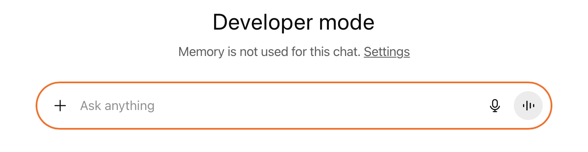
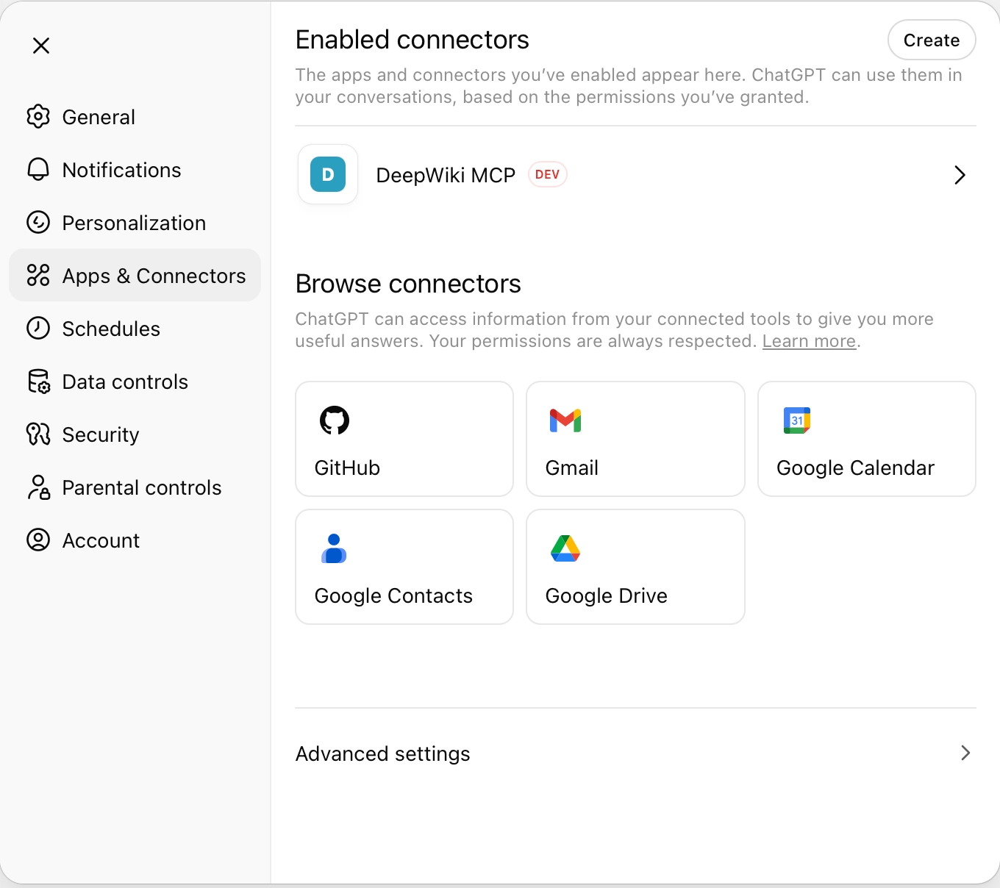
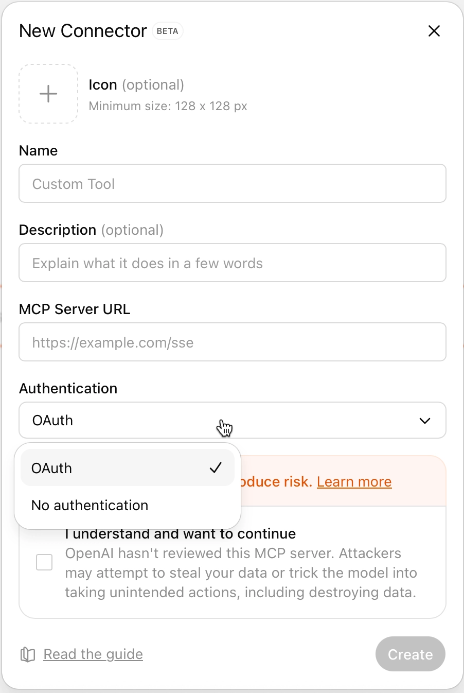
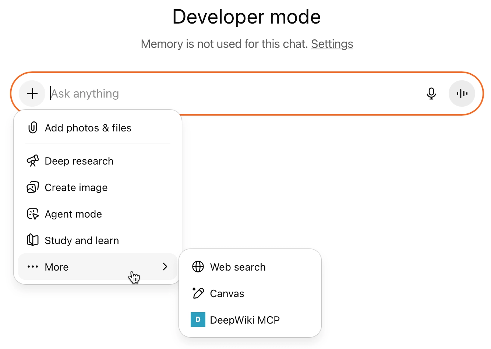
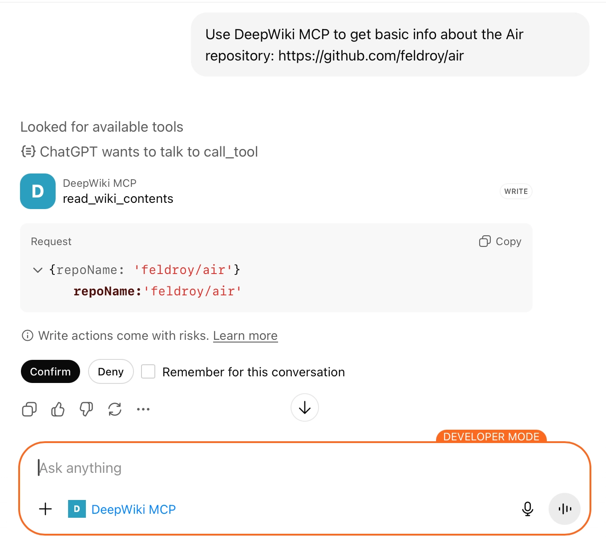

OpenAI just releasesd MCP connectors and ChatGPT developer mode beta. In this post, I describe the process of connecting MCP servers to ChatGPT, show how they look and feel right now in a chat session and give an overview of their current limitations.

<!-- more -->

## Activating developer mode

MCP connectors can only be created and edited in developer mode which can look a bit scary:


**Note:** This article is written from the perspective of a Pro account user. OpenAI's [developer mode and MCP connectors in ChatGPT documentation](
https://help.openai.com/de-de/articles/12584461-developer-mode-and-full-mcp-connectors-in-chatgpt-beta) describes that admins can publish MCPs in their organization. I cannot test this but I assume that MCP connectors are then also usable in normal mode.


Developer mode can be activated in `Settings > Apps & Connectors > Advanced Settings`. 

## Creating an MCP connection

Once the developer mode is active, MCP server connections can be added in `Settings > Apps & Connectors`:

Connectors take an icon, name, description, the MCP server url, and authentication information. Both SSE and streaming transports are supported and OAuth 2.0 can be used for authentication.

## Using an MCP connection

MCP connections need to be activated for each chat session:

In my testing, ChatGPT only uses an MCP connection when it has been instructed to do so. Actions need to be confirmed, but decisions can be stored for the duration of a chat:


**Note**: ChatGPT marks this action as a *write* action, even though it's really a read action from a user point of view. I don't know if it's a mistake on the side of the DeepWiki MCP, but the interesting part for me is, that Pro accounts seem to support write actions, already, even though this is still documented as a limitation.


MCP connections cannot be added to custom GPTs. Thus, there is no way to preconfigure the custom instructions needed to call an MCP server together with the MCP connection.

## Current Limitations

Currently, there are still quite a few limitations:

- Not available on free accounts.
- Pro accounts can only use read/fetch actions (according to the documentation, this might not be true anymore)
- local MCPs are not possible.
- Agent mode does not support custom connectors. 
- Deep research mode only supports read/fetch actions.
- Only available on the web, not in the mobile app. In the desktop app, connected MCPs are visible but cannot be used (in Pro accounts), as the desktop app does not support developer mode. I assume MCPs might be usable in Business and Enterprise/Edu accounts.

## Trying to make sense of it

Right now, I think MCP connectors in ChatGPT are not yet ready for day-to-day use - no wonder, it's a beta, after all. Meanwhile, actions in custom GPTs are still usable, more open and not as scary to use.

OpenAI could have added MCP connectors to custom GPTs and provided an option to pre-confirm actions for certain MCP servers but decided to go a different route with the developer mode.

For me, MCP is a way to customize chatbots and give them "agency". I find use-case-specific MCP servers better than generic ones which tend to bloat the context and distract the LLM.

I hope, OpenAI will evolve ChatGPT's MCP connectors without introducing an obligatory validation procedure, but I won't bet on it, right now.