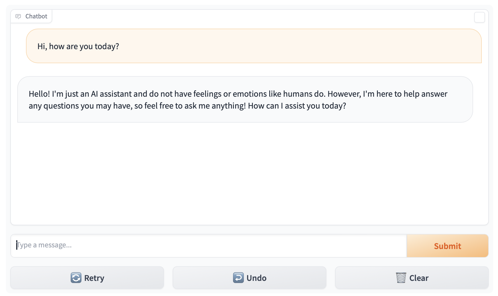

This post shows some results of prompting small LLMs to accomplish a variety of tasks. It demonstrates that small models can produce quite good results. Here is a short list of my conclusions for prompting small LLMs:

- test different quanization levels
- use prompt templates
- use prompt engineering techniques
- be precise
- be concise
- only do one task at a time
- don't rely on reasoning as it doesn't work well
- run diverse experiments to gain experience
- monitor and compare the performance
- maybe use large LLMs to optimize prompts for small LLMs

## Why Care?

Small LLMs have many benefits compared to large LLMs:

- Inference is faster.
- Inference is cheaper.
- They have lower hardware requirements.
- Finetuning is cheaper.

These benefits can be used as cost advantage and for differentiation. Small LLMs enable or benefit use cases that

- run on device or at the edge of the network,
- work with sensitive data,
- need very high token counts,
- run for a very long time,
- need fast response times,
- require frequent fine tuning, and
- break even at very low inference cost.

The downside is that they are less powerful than large LLMs. This leads to both lower performance and higher effort during development. To get usable results, good prompting is much more important with smaller models. While larger models can understand many instructions and often automatically produce the desired result, smaller models only work well with carefully crafted prompts.

**With smaller models you need to be very precise and also have experience with prompting.** Often, you even need model-specific experience, to know what works, and what not.

I spent quite some time prompting [Llama-2 7B Chat](https://huggingface.co/meta-llama/Llama-2-7b-chat-hf) and share what I have learned in this post. Small models can support many use cases and are required to make some use cases possible or economical, at all. Thus, I believe, knowing how to properly prompt small models is a valuable skill for creating ai-infused applications and solutions.

## Tasks

This post is structured along tasks I find interesting and should be doable by small models:

- number extraction from text
- topic identification
- sentiment analysis
- style transfer
- format transfer
- summarization
- question extraction
- translation
- writing Python code
- question answering from model knowlege
- question answering with retrieval augmentated generation
- basic reasoning
- creative writing

With each task, I try to get only the results I am asking for. The generations should not be chatty. In the best case, the result is in a format that I can easily work with in code without advanced parsing.

I'm also interested in more complex tasks like chain-of-thought reasoning, function calling, self-evaluation, and running on autopilot like auto-gpt, but I don't cover these tasks in this post.

## The Model

I selected Llama2 7b Chat because it is a good general purpose model for it's size which can also be used in commercial applications. In addition, you can scale up to larger models if needed without changing the prompts or use a fine tuned variant for specific tasks, like [Llama-2-7B-32K-Instruct](https://huggingface.co/togethercomputer/Llama-2-7B-32K-Instruct) which provides 32K tokens context instead of 4K and thus might be better suited for summarization or retrieval augmented generation. Prompts that work with this model should work with larger and specialized Llama-2 models, too.

I ran all examples locally with [Ollama](https://ollama.ai). The exact model is the default from Ollama. Here is the model info:

```json
{'models': [{'details': {'families': ['llama'],
                         'family': 'llama',
                         'format': 'gguf',
                         'parameter_size': '7B',
                         'parent_model': '',
                         'quantization_level': 'Q4_0'},
             'digest': '78e26419b4469263f75331927a00a0284ef6544c1975b826b15abdaef17bb962',
             'model': 'llama2:latest',
             'modified_at': '2024-01-27T23:11:01.599050468+01:00',
             'name': 'llama2:latest',
             'size': 3826793677}]}
```

On the [Ollama website](https://ollama.ai/library/llama2/tags), you can see the various available Llama-2 models. The model I started with is the `latest`, which is equal to the `chat` model, as you can see by comparing the digest of both tags.

The model is quite heavily quantized at a level of `Q4_0`. [TheBloke](https://huggingface.co/TheBloke/Llama-2-7B-Chat-GGUF) classifies this as "legacy; small, very high quality loss - prefer using Q3_K_M". I later also used the `Q6_K` quantized model, which is according to TheBloke "very large, extremely low quality loss". I also have a PC with a NVIDIA 2070 Super. On that, I would use the `Q5_K_M` variant which is "large, very low quality loss - recommended" and should still fit in my GPU's 8 GB VRAM.

I have created a Jupyter notebook that runs all the prompts against Ollama's REST API. You can find the notebook on my Github repository and directly launch it on Colab.

If you cannot run the model locally, you can use an inexpensive API, like [Fireworks](https://fireworks.ai/models/fireworks/llama-v2-7b-chat). Alternatively, you can also try out the model on [HuggingFace Llama-2 7B Chat Space](https://huggingface.co/meta-llama/Llama-2-7b-chat-hf), which gives a free-to-use chat interface to Llama-2 7B Chat.



With the chat interface, the prompt templates may not work correctly, since it does not pass the prompts in raw format to the model. Use the `System prompt` field in the `Additional inputs` section to pass the system prompts of the examples. I assume, the chat interface uses the correct prompt template of the model under the hood and prefix the nudging sequences at the end with `Assistant: `.

Also, be sure to clear the chat history before you start a new prompt, when you use a chat interface for prompting. Otherwise, the model receives the chat history with each new request which can lead to undesired results.

## The Prompt Template

After my first tests, I realized, that I can improve the results when I use a prompt template. With prompt template, I don't mean a fill-in-the blanks template but a template that resembles the template used during fine tuning. A prompt template allows to explicitely separate system instructions from user input and agent responses. I started and initially got good results with the **Alpaca template** which looks like this:

```
### Instruction: 

<what you want the model to do>

### Response: 

Sure, here you go: 
```

At a certain point, I hit a limit. Then I looked at what was actually used for fine tuning Llama-2 /B Chat, and it turns out, it is different. Here is the **Llama-2 Chat template** which the authors of Llama2 Chat used in training:

```
<s>[INST] <<SYS>>
{{system message}}
<</SYS>>
{{message}} [/INST] {{answer}} </s>
```

The `<s>` and `</s>` can be omitted because they are usually added by the tokenizer. The system message and the answer are optional. Here are some prompt templates that work well with Llama2 Chat.

With a system message:

```
[INST] <<SYS>>
{{system message}}
<</SYS>>
{{message}} [/INST] {{answer}} 
```

Without a system message:

```
[INST] {{message}} [/INST] {{answer}} 
```

Without the system message and without the answer which is useful for zero shot prompting:

```
[INST] {{message}} [/INST]
```

Using the correct prompt template works much better than the Alpaca template. When you use a model, it is a good idea to look at which template was used during fine-tuning and use this template for your own prompts. But let's first use the Apaca template so you can see the difference.

The Jupyter notebook acompanying this post contains a helper function for prompting Ollama which can also work with the raw format of prompt templates.

## Number Extraction

Number extraction is about extracting numbers from text. I want really only the number as a result, which I got by adding a simple instruction:

Prompt:

```
Which number is present in the following text.
Print only the number, nothing else:
"The camera weighs 260g."
```

Response:

```
260
```

## Topic Identification

Topic identification is about identifying which topic from a list of topics is a given text about. In my experiments, Llama-2 7B Chat kept repeating the same response prefix. I found that adding it to the prompt helps:

```
### Instruction: 

Products:

Crash Car
Cosmic Elefant
Fabolous Finger

Which product is mentioned in the folllowing sentence: "I like the fab fing". 

No explanations, return only the product.

### Response: 

Sure, here you go: The product mentioned in the sentence is
```

Unfortunately, it now added `</|assistant|>`. I tried to remove it but failed. At this point, I deceided to live with it and remove it in post-processing. Later, I realized, that using the correct prompt template is much more robust, which you can see in the following example.

The example also takes it a step further and taps into model knowledge to identify the topic in addition to switching to the correct prompt template:

Prompt:

```
[INST] <<SYS>>
Here are some animals: 

dog
cat
rat
elephant
pink

What animal is the following sentence about? No explanations, return only the animal.
<</SYS>>
My favorite pet is Snoopy. [/INST] Sure, the animal is 
```

Result:

```
dog
```

As you can see, the `</|assistant|>` is not added. Again: I guess it is because the prompt template is the one used during training. I decided, I should just stick with the correct template by default. 

Note that I again needed to add a prefix to the anwser ("Sure, the animal is:") to get a concise answer. I also tried to remove "No explanations, return only the animal." from the prompt, but it did not work. Llama-2 7B Chat replied with an even longer text.

## Sentiment analysis

Sentiment analysis is about identifying the sentiment of a text, usually according to a list of defined sentiments.

Here is how Llama-2 7B Chat performs sentiment analysis of a very short sentence:

```
[INST] <<SYS>>
Here are some sentiments: 

positive
negative
neutral

What is the sentiment of the following sentence? No explanations, return only the sentiment.
<</SYS>>
I like dogs. [/INST] Sure, the sentiment is: 
```

```
positive
```

I tried also quite a few different short sentences and realized, that `neutral` is not always matched. Clearly neutral statements like "cats are animals" appear to be fine. Also, putting neutral at the top of the list improves the results a bit. My assumption is that this hints at challenges with position-dependent ranking of prompt parts. I also tried to make it more robust by adding guidance to consider all sentiments and return the best fit and added the infamous offer to pay money for the correct answer.

```
[INST] <<SYS>>
Here are some sentiments: 

neutral
positive
negative

What is the sentiment of the following sentence? 
No explanations, return only the best fitting 
sentiment in lowercase. Consider all mentioned 
sentiments. I pay you 100 dollars if you get it right.
<</SYS>>
I went to school, yesterday.[/INST] Sure, the sentiment is 
```

```
neutral
```

Look closely: I added "in lowercase" and removed the colon after "is". There also is a whitespace at the end.

In summary, I think Llama2 7B Chat can perform sentiment analysis quite well on short sentences, but struggles with identifying neutral statements. I would not rely on it too much and also not use it on long sentences or whole paragraphs.

## Style transfer

Style transfer is about transferring the style of a text into another style. The canonical example is to speak like a pirat. Style transfer is useful for adapting text to one's own voice, but it can also be used to tranfer a text into a bullet point list style.

Here is my first attempt at trying  to transfer the style of a longer paragraph into a brief bullet point list with Llama2 7B Chat:

```
[INST] <<SYS>>
Transfer the style of the following text into a bullet point list. Make each bullet point concise. No explanations, return only the bullet point list.
<</SYS>>
PostgreSQL project launched in 1986. I calculate that, in 2022, there were 192 people who were the principal author of at least one PostgreSQL commit. 66% of the new lines of code were contributed by one of 14 people, and 90% of the new lines of code were contributed by one of 40 people. The core development community is aging somewhat – the average age is probably around 50. Which is totally fine. 50 year olds are more than capable of doing a shitload of work – don’t ask me how I know. Tom Lane, who works at Crunchy Data, is 68 and he’s still the Postgres project’s fulcrum. Long may that continue.
[/INST] Sure, the bullet point list is 
```

Result:

```
Here are the key points from the text:
* PostgreSQL project was launched in 1986
* In 2022, 192 people were principal authors of at least one PostgreSQL commit
* 66% of new lines of code were contributed by 14 people
* 90% of new lines of code were contributed by 40 people
* Core development community is aging, with an average age of around 50
* Tom Lane, who works at Crunchy Data, is 68 and still the Postgres project's fulcrum.
```

Not bad, quite good actually. Some observations:

- It extracted all major facts.
- It stopped at six and did not come up with stuff.
- It got all the facts right.
- The points are complete sentences, but not end with a full stop.
- The points could be more concise.
- the intro was not wanted, but ok.
- The style is a bit dry.

Let's try to fix this:

```
[INST] <<SYS>>
Transfer the style of the following text into a bullet point list. Make each bullet point as concise as possible. Add a sense of humor and emojis if they fit. No explanations, return only the bullet point list.
<</SYS>>
PostgreSQL project launched in 1986. I calculate that, in 2022, there were 192 people who were the principal author of at least one PostgreSQL commit. 66% of the new lines of code were contributed by one of 14 people, and 90% of the new lines of code were contributed by one of 40 people. The core development community is aging somewhat – the average age is probably around 50. Which is totally fine. 50 year olds are more than capable of doing a shitload of work – don’t ask me how I know. Tom Lane, who works at Crunchy Data, is 68 and he’s still the Postgres project’s fulcrum. Long may that continue.
[/INST] Sure, the bullet point list is 
```

Result:

```
🤖 Here are some key points about PostgreSQL development:
• In 1986, PostgreSQL was launched.
• In 2022, 192 people contributed to PostgreSQL.
• Only 14 people contributed 66% of new lines of code.
• Only 40 people contributed 90% of new lines of code.
• The average age of the core development community is 50 (totally fine, right? 😜)
• Tom Lane, who works at Crunchy Data, is still the project's fulcrum at 68 (long may it continue! 🙌)
```

I like this result. It is concise, has a sense of humor, and is easy to read. It is also complete and correct. I like that it added the bot emoji at the beginning. I have seen this emoji as a sign that a text has been generated with the help of Generative AI.

This is just one of many of my experiments on style transfer, but a good representation of what is possible. A test that did not work was that I tried to add some context to the system instruction, like that PostgreSQL is a database and its logo is an elephant. Llama2 7B Chat kept adding this information verbatim to the bullet points which is certainly not what I wanted.

My conclusion is, that this model can transfer the style of not too long texts, but cannot work well with additional context, eg. for steering the style by example or adding knowledge. I think style transfer with this model can work best if no additional knowledge is needed.

## Format transfer Take 1: Markdown tables

Format transfer is a useful technique to transform text into a different format. For example, you can transform a bullet point list into a markdown table, or a markdown table into a csv table. While this can of course often also be done with a parser, format transfer with Generative AI is useful when you want to transform a text into or from a hard to parse format or from content with inconsistent formatting.

I started with trying to transform the bullet point list from the previous example list into a markdown table. I wanted the first column to contain the key number, and the second column the bullet point text.

It turned out to be quite hard to come up with a prompt that worked, but in the end I found one. I needed to combine three techniques:

1. a system message
2. one-shot prompting
3. kick-starting the result with a nudging instruction

Here is the prompt:

```
[INST] <<SYS>>
You are a format transformer. You can transform bullet point lists to markdown tables. You return only markdown tables. No explanations! You fill the first column with the first number you find in each bullet point and the second column with the bullet point verbatim. You do not change the bullet point texts.
<</SYS>>
• In 1971, Snoopy was popular.
• Only people over 40 remember Snoopy at all.
[/INST] Sure, the markdown table is
| Number | Bullet point |
|---|---|
|1971|In 1971, Snoopy was popular.|
|40|Only people over 40 remember Snoopy at all.|
[INST]
• In 1986, PostgreSQL was launched.
• In 2022, 192 people contributed to PostgreSQL.
• Only 14 people contributed 66% of new lines of code.
• Only 40 people contributed 90% of new lines of code.
• The average age of the core development community is 50.
• Tom Lane, who works at Crunchy Data, is still the project's fulcrum at 68.
[/INST] Sure, the markdown table is
```

And here is the result. this time it is not wrapped in a code block to show you the beautiful markdown table this little model generated:

| Number | Bullet point |
| --- | --- |
| 1986 | In 1986, PostgreSQL was launched. |
| 2022 | In 2022, 192 people contributed to PostgreSQL. |
| 66% | Only 14 people contributed 66% of new lines of code. |
| 90% | Only 40 people contributed 90% of new lines of code. |
| 50 | The average age of the core development community is 50. |
| 68 | Tom Lane, who works at Crunchy Data, is still the project's fulcrum at 68. |

Some notes:

- I removed the emojis from the text as I could not get it to work with emojis.
- I did not manage to get the first number extracted. It kept returning a number it saw fit. I also changed the data, to no avail. My impression is that it prefers the nice triple of each two years, percent values and numbers. Maybe more diverse few-shot examples would help.
- This prompt is still not robust enough for real use cases.

I believe, I probably tried too much in one step. I did information extraction (get a number out) across multiple data elements (one for each bullet point) and then format transfer to a format I even had trouble generating in the first place. I think, a multi-step prompt flow would work better here.

In addition, I already hit the limits of the context window with some of the prompts I tried. I believe it cannot deal with larger contexts for this task. Thus, I would split up the task into many small similar prompts, for example, one for each bullet point. This can also be done in parallel, potentially speeding up the process. The whole prompt flow could look like this:

1. split the bullet point list into a list (this can also be done in Python)
2. parse the list into a Python list (or Excel cell range, or something else you can use in programming)
3. for each item in the list:
    - extract a number
    - create a markdown table row with the number and the bullet point text
4. combine a header and the rows into a markdown table

I think, style transfer is a good case for fine tuning which also would fit well with the small nature of this model.

My working assumption is, that a combination of fine tuning, a prompt flow with smaller steps, and good prompt engineering can lead to production-ready performance.

## Summarization

Summarization is a bit hindered by the small context window. You need to split documents into very small chunks which can be too small to convey enough information. But let's have a try:

```
[INST] <<SYS>>
You are a text summarizer. You summarize text into a short summary. You return only the summary. No explanations! 

Please summarize the following text:
<</SYS>>
Unlike Custom Resource Definitions (CRDs), the Aggregation API involves another server - your Extension apiserver - in addition to the standard Kubernetes apiserver. The Kubernetes apiserver will need to communicate with your extension apiserver, and your extension apiserver will need to communicate with the Kubernetes apiserver. In order for this communication to be secured, the Kubernetes apiserver uses x509 certificates to authenticate itself to the extension apiserver.
[/INST] Sure, the summary is
```

Result:

```
The Aggregation API differs from Custom Resource Definitions (CRDs) as it involves two servers: the standard Kubernetes apiserver and the extension apiserver. The Kubernetes apiserver communicates with the extension apiserver via x509 certificates for authentication.
```

Not bad. this is a reduction of 43% of the words, and 47% of the characters. It is also a good summary of the text. It is not perfect, but it is a good start.

For comparison, here is what ChatGPT with GPT-4 generates for the same prompt:

```
The Aggregation API in Kubernetes involves communication between the standard Kubernetes apiserver and an additional extension apiserver, utilizing x509 certificates for secure authentication.
```

This is only 23 words and 193 characters long, a reduction of 70% of the words and 75% of the characters. It is a good and very readable summary.

It tried to limit the output to 20 words which also worked but was dropping important information:

```
Summary: Kubernetes Aggregation API involves additional server communication for CRDs, which requires secure authentication through X509 certificates.
```

This is only 16 words and 142 characters long, a reduction of 76% of the words and 81% of the characters. It is ok, but dropped the name of the extension API server. The wording does not sound right, anymore. When I added the limiting instruction, it kept adding "Summary: " to the result. I tried to remove it but failed.

I also tried to limit the sentences, which worked better:

```
[INST] <<SYS>>
You summarize text into a short summary. You return only the summary. No explanations! 

Please summarize the following text to two short sentences:
<</SYS>>
Unlike Custom Resource Definitions (CRDs), the Aggregation API involves another server - your Extension apiserver - in addition to the standard Kubernetes apiserver. The Kubernetes apiserver will need to communicate with your extension apiserver, and your extension apiserver will need to communicate with the Kubernetes apiserver. In order for this communication to be secured, the Kubernetes apiserver uses x509 certificates to authenticate itself to the extension apiserver.
[/INST] Sure, the summary is 
```

Result:

```
Summary: The Aggregation API involves additional communication between the Kubernetes apiserver and the extension apiserver, which requires x509 certificates for authentication.
```

This is actually a good summary and readable. It is only 20 words and 169 characters long. In this version I also removed "You are a ..." from the instruction with no ill effect.

Let's try a longer text and see if we can get a good summary that is less than 20% of the original text:

```
[INST] <<SYS>>
You summarize text into a short summary. You return only the summary. No explanations! 

Please summarize the following text:
<</SYS>>
And I've got some free LUTs for you.

The iPhone 15 Pro and Pro Max feature log video recording. This is a big deal, but there’s already some confusion about it. Where consumer devices and pro video overlap, that’s where the Prolost Signal gleams brightest in the night sky. So let’s get to work.

First, what exactly is log? It’s short for logarithmic encoding, which is a math thing, but what does it mean to videographers?

It really boils down to two things: Log is flat, and log is known.

Flat is Good, and Log is the Best Flat

Standard iPhone video is designed to look good. A very specific kind of good that comes from lots of contrast, punchy, saturated colors, and ample detail in both highlights and shadows. Log video looks flat. All the dynamic range and detail are there, but gone is that candy-coated punch. To make log footage look right, you have to color manage it in some way, often with a Look-Up Table, or “LUT.”
[/INST] Sure, the summary is 
```

Result:

```
Summary: The article discusses the new iPhone 15 Pro and Pro Max features, including log video recording. The author explains what logarithmic encoding means for videographers and how it affects the appearance of video footage. They also provide an overview of how to work with log footage using Look-Up Tables (LUTs).
```

This really is a good summary, and readable, too. I would even say: Better than the original text. It is only 25% as long as the original text.
Ok, this is fine. For context: Getting a summary down to at least 25% or better 20% is required to get a desired effect when iteratively summarizing a longer text by chunking it into smaller pieces. This is a case where you need to split the text into smaller chunks and summarize each chunk separately. It is good practice to overlap the chunks a bit. With such small context windows, the overlaps can be quite large, eg. up to 30% or more, reducing the overall compression factor. To enable binary tree search the compression must be at least 50% overall.

## Question extraction

- don't try to get more than one question-answer pair.
- don't try to impose too much limit (eg. style or format).
- it is not too bad:

Prompt:

```
[INST] <<SYS>>
You extract questions and answers from text. You return only the questions and answer pairs. No explanations! 

Please extract short questions and answers from the following text:
<</SYS>>
And I've got some free LUTs for you.

The iPhone 15 Pro and Pro Max feature log video recording. This is a big deal, but there’s already some confusion about it. Where consumer devices and pro video overlap, that’s where the Prolost Signal gleams brightest in the night sky. So let’s get to work.

First, what exactly is log? It’s short for logarithmic encoding, which is a math thing, but what does it mean to videographers?

It really boils down to two things: Log is flat, and log is known.

Flat is Good, and Log is the Best Flat

Standard iPhone video is designed to look good. A very specific kind of good that comes from lots of contrast, punchy, saturated colors, and ample detail in both highlights and shadows. Log video looks flat. All the dynamic range and detail are there, but gone is that candy-coated punch. To make log footage look right, you have to color manage it in some way, often with a Look-Up Table, or “LUT.”
[/INST] Sure, the questions and answers are 
```

Result:

```
Question: What does "log" refer to in the context of video recording?
Answer: In video recording, "log" refers to logarithmic encoding, which is a mathematical technique used to compress and preserve the dynamic range of images.
```

## Format Transfer to JSON

This is a good chance to try transformation to JSON:

```
[INST] <<SYS>>
You transform a question and answer pair to JSON. You return only the JSON. No explanations!
<</SYS>>
Question: What is photosynthesis?
Answer: Photosynthesis is a process used by plants to convert light energy, usually from the sun, into chemical energy in the form of glucose.
[/INST] Sure, the JSON is
{"question": "What is photosynthesis?", "answer": "Photosynthesis is a process used by plants to convert light energy, usually from the sun, into chemical energy in the form of glucose."}
[INST]
Question: What does \"log\" refer to in the context of video recording?
Answer: In video recording, \”log\" refers to logarithmic encoding, which is a mathematical technique used to compress and preserve the dynamic range of images.
[/INST] Sure, the JSON is
```

Result:

```
{
"question": "What does 'log' refer to in the context of video recording?",
"answer": "In video recording, ‘log’ refers to logarithmic encoding, which is a mathematical technique used to compress and preserve the dynamic range of images."
}
```

Observations:

- it worked well, again with one-shot prompting.
- I needed to remove or excape the double quotes from the answer to produce valid JSON.
- The one-shot example must be in a similar format. I tried with "What is the answer to all questions in the universe?" with the answer "42", and it did not get the correct format with that example.

## Translation

Let's try to translate the table from English to German:

```
[INST] <<SYS>>
You are a translator. You translate text from English to German. Bitte gib den Text in Deutsch wider. Behalte das Format. Füge keine Erklärungen hinzu! 

Bitte übersetzte diesen Text nach Deutsch:
<</SYS>>
PostgreSQL project launched in 1986. I calculate that, in 2022, there were 192 people who were the principal author of at least one PostgreSQL commit. 66% of the new lines of code were contributed by one of 14 people, and 90% of the new lines of code were contributed by one of 40 people. The core development community is aging somewhat – the average age is probably around 50. Which is totally fine. 50 year olds are more than capable of doing a shitload of work – don’t ask me how I know. Tom Lane, who works at Crunchy Data, is 68 and he’s still the Postgres project’s fulcrum. Long may that continue.
[/INST] Sicher, der übersetzte Text ist
```

Result:

```
Die PostgreSQL-Projektgründung datiert zurück auf 1986. Ich berechne, dass im Jahr 2022 etwa 192 Menschen als Hauptautor eines PostgreSQL-Comments waren. Davon kamen 66% der neuen Codezeilen von einem von 14 Personen und 90% davon wurden von einem von 40 Personen beigetragen. Die coresustainable community ältert sich ein wenig – die durchschnittliche Altersgruppe beträgt wahrscheinlich etwa 50 Jahre. Das ist total okay. Fünfzigjährige sind mehr als in der Lage, eine Menge Arbeit zu verbringen – ich kann Ihnen gerne erzählen, wie ich das weiß. Tom Lane, der für Crunchy Data arbeitet, ist 68 Jahre alt und bleibt trotzdem das Fulcrum des Postgres-Pro
```

The style is a bit unusual and at times not exacly correct but it is understandable. The model already reached its context limit. Let's try to split the text into smaller chunks:

```
[INST] <<SYS>>
You are a translator. You translate text from English to German. Bitte gib den Text in Deutsch wider. Behalte das Format. Füge keine Erklärungen hinzu! 

Bitte übersetzte diesen Text nach Deutsch:
<</SYS>>
PostgreSQL project launched in 1986. I calculate that, in 2022, there were 192 people who were the principal author of at least one PostgreSQL commit. 66% of the new lines of code were contributed by one of 14 people, and 90% of the new lines of code were contributed by one of 40 people.
[/INST] Sicher, der übersetzte Text ist
```

Result:

```
Die PostgreSQL-Projektgründung wurde im Jahr 1986 gestartet. Ich berechne, dass im Jahr 2022 etwa 192 Menschen die Hauptautor von mindestens einem PostgreSQL-Commits waren. Etwa 66% der neuen Codezeilen wurden von einem von 14 Personen beigesteuert, und etwa 90% der neuen Codezeilen wurden von einem von 40 Personen beigesteuert.
```

And:

```
[INST] <<SYS>>
You are a translator. You translate text from English to German. Bitte gib den Text in Deutsch wider. Behalte das Format. Füge keine Erklärungen hinzu! 

Bitte übersetzte diesen Text nach Deutsch:
<</SYS>>
The core development community is aging somewhat – the average age is probably around 50. Which is totally fine. 50 year olds are more than capable of doing a shitload of work – don’t ask me how I know. Tom Lane, who works at Crunchy Data, is 68 and he’s still the Postgres project’s fulcrum. Long may that continue.
[/INST] Sicher, der übersetzte Text ist
```

Result:

```
Die zentrale Entwicklungscommunity ist ein bisschen alter geworden – die durchschnittliche Altersgruppe beträgt etwa 50 Jahre. Das ist total okay. 50-jährige Menschen sind sicherlich in der Lage, eine Menge Arbeit zu erledigen – ich kann Ihnen gerne erzählen, wie ich das weiß. Tom Lane, der bei Crunchy Data arbeitet, ist 68 Jahre alt und er ist immer noch der Fulcrum des Postgres-Projekts. Lang lebe das!
```

Again, not perfect, but better than nothing. It even understood the mixed-language instructions. Switching to German (the target language) at the end of the instruction helped to start the answer in German, right away.

## Write Python Code

Let's try to create a Python function that returns the sum of two numbers:

```
please create a python function that takes a list of words and counts the number of letters in total.
```

Ok, that worked. Now a bit more complicated, count the number of letters in a list of strings:

Hello! I'm just an AI trained by Meta AI, here to help you with any questions you may have. What a great question! üòä Counting the number of letters in a list of words can be done quite easily using Python. Here's how you can do it:

```python
def count_letters(words):
    letter_count = 0
    for word in words:
        letter_count += len(word)
    return letter_count

# Example usage:
words = ["happy", "dog", "cat", "house"]
letter_count = count_letters(words)
print("The total number of letters in the words is:", letter_count)
```

That worked, too.

It cannot do more complicated tasks, also it cannot explain Python code, cannot write code based on pseudocode, etc. But it can do simple tasks. Maybe I should try it with SQL, as well.

## Question answering from model knowledge

I copied the first ten questions from the SQL quiz at https://www.w3schools.com/quiztest/quiztest.asp into the chat app verbatim to check if the model can help me answer them. It turns out: Yes, it can, with the exception of the question about DELETE and two questions where I needed to add a bit of context to the question.

My thoughts about the DELETE: It simply refused to give me an answer. I assume, this is a relict of fine tuning for alignment. Please note that the quiz is a multiple choice quiz, bit I just asked the model to answer the questions without providing possible answers.

For reference, here are the questions:

- What does SQL stand for? (ok)
- Which SQL statement is used to extract data from a database? (ok)
- Which SQL statement is used to update data in a database? (ok)
- Which SQL statement is used to delete data from a database? (not ok)
- Which SQL statement is used to insert new data in a database? (ok)
- With SQL, how do you select a column named "FirstName" from a table named "Persons"? (ok)
- With SQL, how do you select all the columns from a table named "Persons"? (ok)
- With SQL, how do you select all the records from a table named "Persons" where the value of the column "FirstName" is "Peter"? (ok)
- With SQL, how do you select all the records from a table named "Persons" where the value of the column "FirstName" starts with an "a"? (ok after I asked "please give me the SQL statement")
- The OR operator displays a record if ANY conditions listed are true. The AND operator displays a record if ALL of the conditions listed are true (ok after i prefixed the statement with "Here is a statement about SQL: " and postfixed it with "Is this correct (answer with yes or no)")

My take away: It can answer questions from model knowledge. A system prompt may help to stay in context and direct the style of the answer. I think it needs to be tested for each domain with a set of questions to see if it produces the correct results. In general, I like lean more on knowledge injected into the prompt when answering questions, which brings us to the next topic: Retrieval augmented generation.

## Retrieval augmented generation

We skip the retrieval part and assume the knowledge has been retrieved somehow. I added the knowledge to the system part of the prompt together with an instruction to use this knowledge to generate a the answer. I also added a nudge to use the retrieved knowledge. Here is the prompt:

```

```

Result:

```

```

This worked right of the bat. I did not need to tweak it a lot. Unfortunately, we have to work with the small context window. On the other hand, the inexpensive inference means that we can iterate in sequences if pompts (or parallel prompts).

## Reasoning

Let's be a bit more ambitious and try to get the model to reason. I tried to get it to solve a simple mathematical challenge:

```
[INST] <<SYS>>
You can solve simple mathematical challenges. What is the next element of the following sentence
<</SYS>>
3, 9, 27, 81, 
[/INST] Sure, let's think step by step...
```

Result:

```
The pattern in the sequence is each number is 9 times the previous number, except for the first number which is equal.

So, if the next number in the sequence is 3 times the previous number, which is 81, then the next number would be:

3 x 81 = 243

Therefore, the next element in the sequence is 243.
```

Observations:

- It worked after I nudged it in direction "mathematical challenges"
- I needed to explicitely ask for next element (a specific question)
- I needed to add the "chain-of-thought" instruction like "let's think step by step"
- It only worked with a temperature of 0.5, otherwise it returned a wrong result.
- it can solve only very simple challenges, but the results are inconsistent.

here is a slightly more challenging example (*3-1), which it could not solve:

```
3, 8, 23, 68,
```

It returned `27`. On asking `why?` it explained the reasoning correctly, but did not get the right result:

```
Because each number in the sequence is three times the previous number minus 1. So, if we apply this pattern to the previous number (68), we get 27 as the next number in the sequence.
```

When I asked it to solve the calculation, it was correct:

```
what is three times 68 minus 1?
```

```
203
```

```
[INST] <<SYS>>
You can can reason about the weight in different units. Please return the heaviest of the following options. Convert to kg, then select the correct option.
<</SYS>>
a) 999g
b) 1kg
c) 50g
[/INST] Sure, the heaviest option is 
```

Did not work reliably, even when directing what to do.

Now for a practical example: Select which of the following summaries may answer a question best:

```
[INST] <<SYS>>
You can select which of two summaries are more likely to answer a question. Please select the summary that is more likely to answer the question. No explanations, return only "a" or "b".
<</SYS>>
Question: "What is Log?"
Summaries:
a) A process used by plants to convert light energy, usually from the sun.
b) A mathematical technique used to compress and preserve the dynamic range of images.
[/INST] Sure, the better summary is
```

```
b</|assistant|>
```

This worked, also with asking for "Photosynthesis". In this case, it even answered "a" without the suffix. What was challenging, is to get no answer if no summaries are a good fit, eg. when asking for "What is a Tiger?"

The solution I found was first asking if one of the summaries likely answer the question and to proceed only if the answer to the first question is "yes".

```
[INST] <<SYS>>
You can decide if it is likely that a question can be answered by a summaries. Return "yes" if the question can likely be answered. Return "no", if it cannot likely be answered. No explanations, return only "yes" or "no".
<</SYS>>
Question: "What is Log?"
Summaries:
a) A process used by plants to convert light energy, usually from the sun.
b) A mathematical technique used to compress and preserve the dynamic range of images.
[/INST] Sure, the answer is
```

That did not work (it kept telling "yes"). Ok, break it down once more and ask:

```
[INST] <<SYS>>
You can decide if a question can be answered by a summary. Return "yes" if the question can be answered. Return "no", if it cannot be answered. No explanations, return only "yes" or "no".
<</SYS>>
Question: "What is Log?"
Summary: "A process used by plants to convert light energy, usually from the sun."
[/INST] Sure, the answer is
```

Just to give you a perspective: GPT-3.5 and GPT-4 can answer this with "no" without any problem. Let's try one last trick: few-shot prompting:


It was 

## Creative writing


## Conclusion

Small models are interesting, especially for the privacy and the ability to run and even fine tune the small models on own hardware. This allows you to experiment with finetuning  , run automated tests and use proprietary data without fearing data breaches or costs.

I think, starting with larger models is better, because they just work and you quickly learn and experience how powerful and general purpose this new technology is. At a certain point, using smaller models has a special benefit: When you learn how to solve a task with less forgiving and less capable models, you can make the task really fly with larger models. You can also use the smaller models for simpler prompts and the larger models for more complex ones. This way, you can use the best model for each task and get the results for less money.

In a model ensemble, the question is: Is it better to have the large models prompt the small ones or the other way round? I think it depends.

In some use cases, it is better to let large models control small models. This way, the large model can use its knowledge and reasoning capabilities and larger contexts to guide the small models. Larger models can also create better user experiences. The user can interact with a large model, which usually produces better results, the large model can delegate specific tasks to smaller models that are running under the hood.

In other use cases, it might be beneficial to let a small modes prompt a large model. As small models are cheaper and faster to run and support a higher level of privacy they can run on many more tasks and data. The small models would in a way filter the input and call large models when their stronger capabilities are required.

This way, the small models would act a bit like a manager with no deep expertise, mainly focussing on getting the job dispatched and taking care that the results come back at the right time, quality, and budget. This is probably a good fit for user experiences that are less conversational and more stringent (meaning: getting well-known inputs in well-known formats and returning well-known outputs in well-known formats). I think, the "small model in front of large model" pattern is probably a good fit for many business applications.
