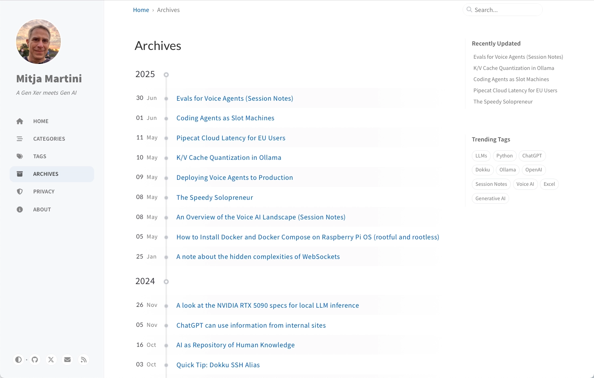

Here are some tipps for migrating a blog to [Hugo](https://gohugo.io), the static website builder.

## Why Migrate? (Maybe don't)

A migration is always more effort than it may seem. It's important to be clear about the reasons to migrate and only migrate when necessary. My reasons for migrating my blog to Hugo were:

- Hugo is in my view the best static site generator, today, as it's flexible, focused, fast, and feature-rich. It can certainly serve the site, today and in the forseeable future.
- Due to it's focus and flexiblity, I plan to use Hugo also for other websites.
- Hugo supports multi-lingual sites out of the box. Jekyll does not really support it.
- Hugo can be used as a rendering target of Quarto and nbdev which means that I can write posts in Jupyter Notebook and don't need to manually transfer them to the blog. 

For me, the compelling reason to switch was Hugo's multi-language support. I also contemplated how I could bring that to Jekyll, but it would have been more effort overall, especially later on.

## Define Objectives

Your main objective should be to do as little as possible. It will get more involved anyway. Writing down your objectives before detailed planning and starting the actual migration will help you keep on track.

My main objective was to benefit from Hugo's additional features, especially multi-language support, while keeping all the links working. 

I also wanted a blog that's easy to use, and easy to keep up-to date. This meant, I would lean into the Hugo way of structuring content (with page bundles) and not continue with the Jekyll way.

## Define Non-Objectives

Initially, I was looking into porting the Chirpy theme to Hugo.

I started vibe-coding a Hugo port of Chirpy, and it was even beginning to look ok-ish, but there were a myriad of things that would have needed to be improved and features like multi-lingual support were missing altogether. 

Not to speak of the code quality. Developing and maintaining a great theme is not a small task and needs dedication. There are great open source themes for Hugo. Use one of these.

Another idea of mine was to move to a different deployment platform. I dropped that, too and decided to stay with GitHub Actions and GitHub Pages to build and publish the blog.

## Choose the Right Theme

Choosing the right theme is at least as important as choosing a great static site generator. I selected the [Blowfish](https://blowfish.page) theme for following reasons:

- I like how it looks,
- it's well-maintained, and well-documented,
- it has a lot of features, including multi-language support, which was the main reason for me to migrate away from Jekyll, in the first place. 
- It's built with TailwindCSS, which I will also use for marketing and documentation sites for apps, and
- its a blogging theme which fits my blog use case better than a more general purpose theme.

Choosing the theme can be quite time consuming. Before I finally selected a theme, I checked three popular Hugo blog themes by 

- browsing their demos, 
- skimming their documentation, 
- looking at sites built with them, 
- checking templates to start using the theme,
- reading some open and closed GitHub issues, 
- reading recent commits, 
- testing them to see how they look with my content,
- reading some experience reports on the net. 

I think the time spent resarching the theme is well-spent, as it avoids needing to migrate away from it, too soon, again. 

## Draft and Follow a Plan

As it's easy to get carried away and do more than necessary, it's important to draft a plan that takes the fewest and simplest steps possible to get from A to B. 

Try to convert a few pages by hand and see what you will need to do. Every plan will be different, as every blog and website is different. 

To give you an example, here is my plan for migrating my small (24 articles) blog from Jekyll and Chirpy to Hugo and Blowfish:

- Create a blog with the Blowfish theme and a template.
- Customize the theme configuration.
- See where content is stored (pages, assets, drafts) and note things you need to transfer.
- Transfer the content:
  - Move from files in the `posts` folder to a page bundle folder and rename the file to `index.md`.
  - Move linked assets to the bundle folder.
  - Remove the frontmatter image part.
  - Rename the cover image to `cover.webp|png|webp`.
  - Adapt front matter: 
    - Add a summary.
    - Rename category to categories.
    - Remove unnecessary entries (eg. `author`).
    - Make sure every source has a permalink entry (most of my posts had) and use the permalink to create `aliases`. Hugo uses these to render redirect pages. This way, the old links will keep working.
  - Adapt content:
    - Replace asset URLs in the content with relative filenames, as the assets are now in the bundle.
    - Replace Jekyll tags with Hugo shortcodes (eg. alert, and YoutubeLite).
- Transfer meta-pages like `About` and `Privacy`, too.
- Adapt the menus (drop template links, add own links, add `About` and `Privacy` to the footer menu).
- Check if the page renders correctly.
- Check that all old links are reachable in the new site (eg. with a script).
- Adapt the GitHub Workflow which came with the Blowfish template. (I needed to update the Hugo version and change the sitename.)
- Commit, tag and push the old blog for a last time.
- Take some screenshots from the old blog for the photo album.
- RRemove everything except `.git`.
- Move the new site into the repo folder.
- Check if it still works, locally.
- Commit, and push to publish the new theme.
- Check the results and take some screenshots from the new blog for the photo album.

The plan grew over time. For example, I realized that I need to adapt Youtube embeds only during conversion. 

I think it's a good idea to adapt the plan as you go. This way, it's a complete checklist for each page. You can also take a quick break to check if the new step is really required.

In the end, the plan will also help you remember what you've missed in the first place.

## Use Scripts

Consider creating or adapting one of the existing [migration script for Hugo](https://gohugo.io/tools/migrations/). 

I think a script is already worth it from twenty or more large posts. You can probably adapt a script to your requirements with vibe coding, but make sure to create backups before running it. And check the results, carefully.

As my blog had only 24 posts in markdown which were easy to adapt, I did not use a script for the migration.

Instead, I've created a little script to check if the pages listed in the old blog's `sitemap.xml` are present the new blog.

The script tested this before pushing the new blog to production by replacing the domain part of the URL with the local dev server.

## Publish, Check, Fix, then Change

I believe it's important to publish the site in a basic version and check if it works, eg. by crawling for missing links, and looking through the content.

You should also check Google Search Console, and Google Analytics after the migration, to see if something is missing.

For a certain period of time after migration, eg. two weeks, focus on making sure nothing is broken. Implement fixes, maybe publish new posts, but don't change too much else.

Only then, start to implement further improvements.

## Don't Underestimate the Effort

In my case, the migration took about a eight hours across two days. 

This does not include counting my ill-attempt at vibe coding a Chirpy port and resarching static site generators and themes. 

Even though the effort was higher than I initially thought (I estimated about four hours), I would consider it a success and quite effective. The site works, links work.

Every migration is a bit different and not everything can be planned up-front. 

It's easy to underestimate the effort. In my case the additional effort was ok, but it could be much higher with larger blogs or more complex migrations. 

This is why I believe it's worth considering hiring an expert with experience in migrating sites to Hugo, especially if you have a larger blog and cannot create or adapt a conversion script to your situation.

## Take Screenshots

I think nice to have screenshots from your old blog and the initial version of your new blog for your photo album. 

Here are screenshots of my blog before and after the migration, presented by the [Blowfish's Gallery Shortcode](https://blowfish.page/docs/shortcodes/#gallery):


  
  
  
  
  
  
  
  
  
  
  
  
